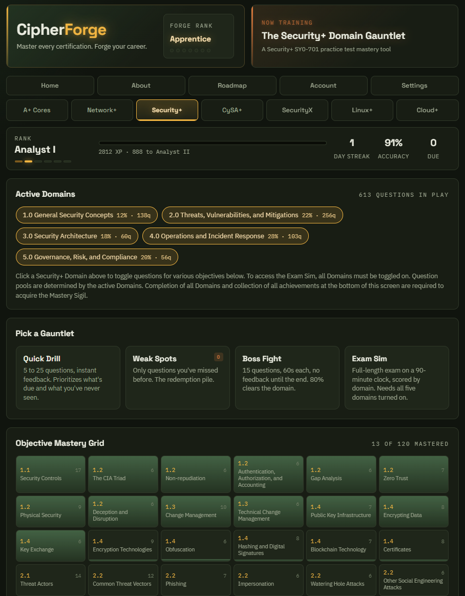
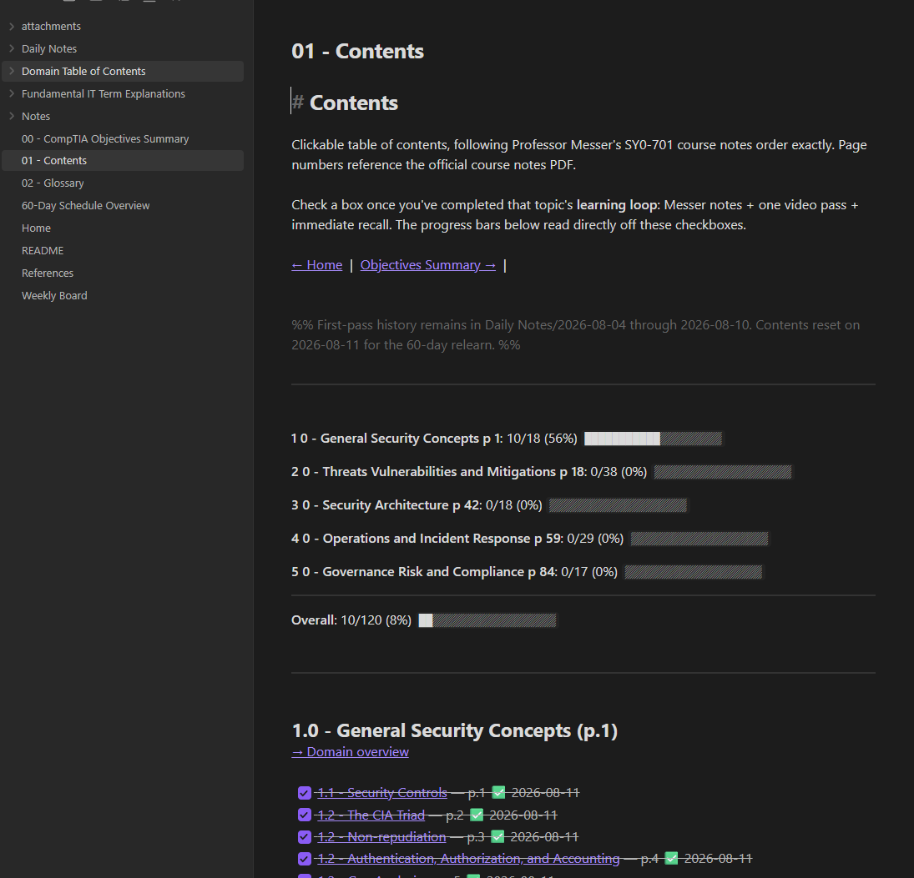

# Brian Rawlins | NexusLeonis

Self-taught through hands-on projects in Linux, virtualization, Docker, networking, cybersecurity, and technical troubleshooting.

## Projects

### CipherForge

**In Development | Source Currently Private**

Browser-based CompTIA certification study platform built around objective-level mastery instead of practice-test scores (you get those too though). It includes custom interactable practice exams, visual progress tracking, spaced repetition, guided hints, detailed answer explanations, learning statistics, and a modular question-bank architecture. The current Security+ SY0-701 content is based in part on Professor Messer course notes and practice exams, which is why the source remains private. I’m expanding the question bank with my own study material and a structured question-format template fed into multiple LLMs to generate more diverse, challenging questions while keeping them aligned to exam objectives.

  

### NexusLeonis Homelab - Legacy

Historical record of my original Proxmox homelab (the first attempt), including virtualization, Docker, Linux administration, centralized NAS storage, monitoring, remote access, GPU passthrough, troubleshooting, and lessons learned.

  

[View the project](https://github.com/NexusLeonis/Nexusleonis-Homelab-Legacy)

### NexusLeonis Homelab - Rebuild

**Upcoming | Build Not Started**

A ground-up rebuild of NexusLeonis designed around the lessons learned from the Legacy environment. The new build is planned around a fresh Proxmox install with two Ubuntu Server VMs, cleaner storage architecture, internal DNS and reverse proxying, NFS integration, Tailscale remote access, GPU passthrough, automated backups, secrets management, and layered access controls. Oh and can't forget this time... DOCUMENTATION.

**Watch this one grow from a blank Proxmox install as I apply the lessons from NexusLeonis Legacy, document the process properly this time, and probably discover entirely new ways to break things at 2am and pretend it's all fine.**

### Security+ Obsidian Vault

Complete custom Obsidian study vault and 60-Day study plan for CompTIA Security+ SY0-701, built around Professor Messer's course and personal study notes. Built to be a vault template and study plan for those studying Security+, or use for other exams.

  

[View the project](https://github.com/NexusLeonis/securityplus-obsidian-vault)
